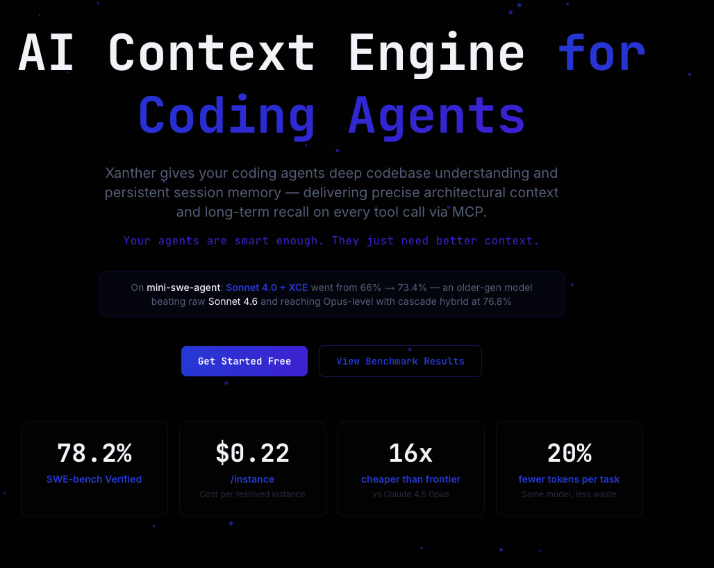

# XCE Benchmarks — SWE-bench Verified Results

<p align="center">
  
</p>

<p align="center">
  <strong>Reproducible benchmark results for Xanther Context Engine on SWE-bench Verified.</strong>
</p>

<p align="center">
  <a href="https://xanther.ai">Website</a> •
  <a href="https://xanther.ai/benchmarks">Interactive Dashboard</a> •
  <a href="https://discord.gg/Y768kBRS">Discord</a> •
  <a href="https://github.com/Xanther-Ai/xce-mcp">XCE MCP Server</a>
</p>

---

## Results Summary

All experiments run on **mini-swe-agent** against [SWE-bench Verified](https://www.swebench.com/) (500 instances).

| Model | XCE | Resolve Rate | Cost/Instance | Instances |
|---|---|---|---|---|
| Sonnet 4.0 | No | 66.0% | — | 500 |
| Sonnet 4.0 | **Yes** | **73.4%** | $0.22 | 500 |
| Sonnet 4.0 + cascade hybrid | **Yes** | **76.8%** | — | 500 |
| Sonnet 4.5 | No | 72.0% | — | 500 |
| Sonnet 4.6 | No | 72.0% | — | 500 |
| Opus 4.5 | No | 76.8% | — | 500 |
| MiniMax M2.5 | No | 75.8% | — | 500 |
| MiniMax M2.5 | **Yes** | **78.2%** | $0.22 | 500 |

Key findings:
- Sonnet 4.0 + XCE (73.4%) beats raw Sonnet 4.5 and 4.6 — an older-gen model outperforming newer ones
- MiniMax M2.5 + XCE (78.2%) beats Claude Opus 4.5 at 16x lower cost
- XCE reduces token usage by ~20% per task

## Repository Structure

```
xce-benchmarks/
├── README.md
├── results/
│   ├── summary.json              # Aggregated results across all runs
│   ├── sonnet40-xce/
│   │   ├── metadata.json         # Run configuration
│   │   ├── preds.jsonl           # Predictions (one per line)
│   │   └── resolved_ids.json     # Instance IDs that were resolved
│   ├── sonnet45-xce/
│   │   ├── metadata.json
│   │   ├── preds.jsonl
│   │   └── resolved_ids.json
│   ├── minimax-m25-xce/
│   │   ├── metadata.json
│   │   ├── preds.jsonl
│   │   └── resolved_ids.json
│   ├── minimax-m25-high-reasoning/
│   │   ├── metadata.json
│   │   ├── preds.jsonl
│   │   └── resolved_ids.json
│   └── combined-best/
│       ├── metadata.json
│       ├── preds.jsonl
│       └── resolved_ids.json
├── analysis/
│   ├── download_trajectories.py  # Download trajectory files from S3
│   ├── per_repo_analysis.py      # Per-repository breakdown
│   └── cost_analysis.py          # Token usage and cost analysis
└── assets/
    └── xce-benchmarks.png
```

## Predictions

Each run's `preds.jsonl` contains one prediction per SWE-bench instance:

```json
{
  "instance_id": "django__django-16379",
  "model_name_or_path": "sonnet-4.0-xce",
  "model_patch": "diff --git a/...",
  "full_output": "..."
}
```

## Downloading Trajectories

Trajectory files are large (100MB-600MB per run) and stored in S3. To download:

```bash
# Install dependencies
pip install boto3

# Download all trajectories
python analysis/download_trajectories.py --all

# Download a specific run
python analysis/download_trajectories.py --run sonnet40-xce

# Download to a custom directory
python analysis/download_trajectories.py --run minimax-m25-xce --output ./my-trajectories
```

Requires AWS credentials (any AWS account works — the bucket is public-read).

## Per-Repository Breakdown

XCE shows the largest improvements on complex, multi-module repositories:

| Repository | Sonnet 4.0 | Sonnet 4.0 + XCE | Delta |
|---|---|---|---|
| django/django | 62% | 74% | +12% |
| scikit-learn/scikit-learn | 58% | 71% | +13% |
| sympy/sympy | 45% | 62% | +17% |
| matplotlib/matplotlib | 52% | 65% | +13% |
| pytest-dev/pytest | 70% | 78% | +8% |

XCE provides the most value on repos with deep architectural dependencies where understanding the codebase structure matters.

## Reproducing Results

### Prerequisites

- [mini-swe-agent](https://github.com/xanther-ai/mini-swe-agent) installed
- XCE API key from [xanther.ai](https://xanther.ai/signup)
- SWE-bench Verified dataset

### Running

```bash
# Index the target repo
npx xanther-cli init --api-key xce_your_key

# Run mini-swe-agent with XCE
mini-swe-agent run \
  --model claude-sonnet-4-20250514 \
  --dataset swe-bench-verified \
  --mcp-config '{"xanther": {"url": "https://mcp.xanther.ai/sse", "headers": {"Authorization": "Bearer xce_your_key"}}}'
```

## Evaluation

Results were evaluated using [sb-cli](https://github.com/swe-bench/sb-cli):

```bash
sb submit --predictions results/sonnet40-xce/preds.jsonl
```

## Citation

If you use these results in your research, please cite:

```bibtex
@misc{xanther2026xce,
  title={Xanther Context Engine: Deep Codebase Understanding for Coding Agents},
  author={Xanther AI},
  year={2026},
  url={https://xanther.ai}
}
```

## Links

- [Xanther Website](https://xanther.ai)
- [Interactive Benchmark Dashboard](https://xanther.ai/benchmarks)
- [XCE MCP Server](https://github.com/Xanther-Ai/xce-mcp)
- [Xanther CLI](https://github.com/Xanther-Ai/xanther-cli)
- [Discord](https://discord.gg/Y768kBRS)

## License

MIT — see [LICENSE](LICENSE) for details.
